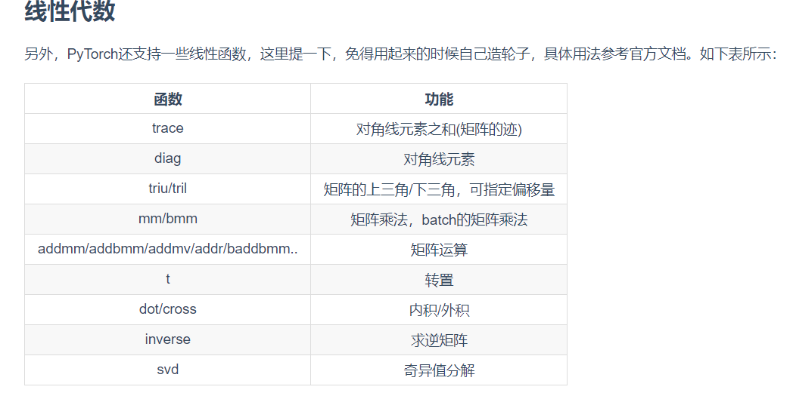

# 动手学深度学习笔记（PyTorch版）

## 一.简介

 <!--more-->

### 1.起源

神经网络都包含以下的核心原则。

- 交替使用线性处理单元与非线性处理单元，它们经常被称为“层”。
- 使用链式法则（即反向传播）来更新网络的参数。

### 2.发展

注意力机制解决了另一个困扰统计学超过一个世纪的问题：如何在不增加参数的情况下扩展一个系统的记忆容量和复杂度。注意力机制使用了一个可学习的指针结构来构建出一个精妙的解决方法 [5]。也就是说，与其在像机器翻译这样的任务中记忆整个句子，不如记忆指向翻译的中间状态的指针。由于生成译文前不需要再存储整句原文的信息，这样的结构使准确翻译长句变得可能。

### 3,特点

**机器学习**研究如何使计算机系统利用经验改善性能。它是人工智能领域的分支，也是实现人工智能的一种手段。在机器学习的众多研究方向中，**表征学习**关注如何自动找出表示数据的合适方式，以便更好地将输入变换为正确的输出，而本书要重点探讨的**深度学习**是具有多级表示的表征学习方法。在每一级（从原始数据开始），深度学习通过简单的函数将该级的表示变换为更高级的表示。因此，深度学习模型也可以看作是由许多简单函数复合而成的函数。当这些复合的函数足够多时，深度学习模型就可以表达非常复杂的变换。

### 4.小结

- 机器学习研究如何使计算机系统利用经验改善性能。它是人工智能领域的分支，也是实现人工智能的一种手段。
- 作为机器学习的一类，表征学习关注如何自动找出表示数据的合适方式。
- 深度学习是具有多级表示的表征学习方法。它可以逐级表示越来越抽象的概念或模式。
- 深度学习所基于的神经网络模型和用数据编程的核心思想实际上已经被研究了数百年。
- 深度学习已经逐渐演变成一个工程师和科学家皆可使用的普适工具。

## 二.数据操作

### 1.创建Tensor

`导入PyTorch：

```python
import torch
```

创建一个5x3的未初始化的`Tensor`：

```python
x = torch.empty(5, 3)
```

创建一个5x3的随机初始化的`Tensor`:

```python
x = torch.rand(5, 3)
```

创建一个5x3的long型全0的`Tensor`:

```python
x = torch.zeros(5, 3, dtype=torch.long)
```

直接根据数据创建:

```python
x = torch.tensor([5.5, 3])
```

通过现有的`Tensor`来创建，此方法会默认重用输入`Tensor`的一些属性，例如数据类型，除非自定义数据类型。

```python
x = x.new_ones(5, 3, dtype=torch.float64)  # 返回的tensor默认具有相同的torch.dtype和torch.device

x = torch.randn_like(x, dtype=torch.float) # 指定新的数据类型
```

可以通过`shape`或者`size()`来获取`Tensor`的形状:

```python
print(x.size())
print(x.shape)
```

**注意：返回的torch.Size其实就是一个tuple, 支持所有tuple的操作。**

### 2.算术操作

**加法形式**

```python
  y = torch.rand(5, 3)
  print(torch.add(x, y))
```

**加法形式、inplace**

```python
  # adds x to y
  y.add_(x)
  print(y)
```

可指定输出：

```python
  result = torch.empty(5, 3)
  torch.add(x, y, out=result)
  print(result)
```


**索引**

要注意的是：**索引出来的结果与原数据共享内存，也即修改一个，另一个会跟着修改。**

```python
y = x[0, :]
y += 1
print(y)
print(x[0, :]) # 源tensor也被改了
```


**改变形状**

用`view()`来改变`Tensor`的形状：

```python
y = x.view(15)
z = x.view(-1, 5)  # -1所指的维度可以根据其他维度的值推出来
print(x.size(), y.size(), z.size())
```

> **注意`view()`返回的新`Tensor`与源`Tensor`虽然可能有不同的`size`，但是是共享`data`的，也即更改其中的一个，另外一个也会跟着改变。(顾名思义，view仅仅是改变了对这个张量的观察角度，内部数据并未改变)**

所以如果我们想返回一个真正新的副本（即不共享data内存）该怎么办呢？Pytorch还提供了一个`reshape()`可以改变形状，但是此函数并不能保证返回的是其拷贝，所以不推荐使用。推荐先用`clone`创造一个副本然后再使用`view`

```python
x_cp = x.clone().view(15)
x -= 1
print(x)
print(x_cp)
```

**使用`clone`还有一个好处是会被记录在计算图中，即梯度回传到副本时也会传到源`Tensor`。**

另外一个常用的函数就是`item()`, 它可以将一个标量`Tensor`转换成一个Python number：

```python
x = torch.randn(1)
print(x)
print(x.item())
```



PyTorch中的`Tensor`支持超过一百种操作，包括转置、索引、切片、数学运算、线性代数、随机数等等，可参考[官方文档](https://pytorch.org/docs/stable/tensors.html)。

`https://pytorch.org/docs/stable/tensors.html`

### 3. 广播机制

前面我们看到如何对两个形状相同的`Tensor`做按元素运算。当对两个形状不同的`Tensor`按元素运算时，可能会触发广播（broadcasting）机制：先适当复制元素使这两个`Tensor`形状相同后再按元素运算。例如：

```python
x = torch.arange(1, 3).view(1, 2)
print(x)
y = torch.arange(1, 4).view(3, 1)
print(y)
print(x + y)
```

由于`x`和`y`分别是1行2列和3行1列的矩阵，如果要计算`x + y`，那么`x`中第一行的2个元素被广播（复制）到了第二行和第三行，而`y`中第一列的3个元素被广播（复制）到了第二列。如此，就可以对2个3行2列的矩阵按元素相加。

### 4. 运算的内存开销

前面说了，索引操作是不会开辟新内存的，而像`y = x + y`这样的运算是会新开内存的，然后将`y`指向新内存。为了演示这一点，我们可以使用Python自带的`id`函数：如果两个实例的ID一致，那么它们所对应的内存地址相同；反之则不同。

```python
x = torch.tensor([1, 2])
y = torch.tensor([3, 4])
id_before = id(y)
y = y + x
print(id(y) == id_before) # False 
```

如果想指定结果到原来的`y`的内存，我们可以使用前面介绍的索引来进行替换操作。在下面的例子中，我们把`x + y`的结果通过`[:]`写进`y`对应的内存中。

> [:]意义：L1=L 意思是将L1也指向L的内存地址,（引用）
>
> L1=L[:] 意思是, 复制L的内容并指向新的内存地址.（复制）

```python
x = torch.tensor([1, 2])
y = torch.tensor([3, 4])
id_before = id(y)
y[:] = y + x
print(id(y) == id_before) # True
```

我们还可以使用运算符全名函数中的`out`参数或者自加运算符`+=`(也即`add_()`)达到上述效果，例如`torch.add(x, y, out=y)`和`y += x`(`y.add_(x)`)。

```python
id_before = id(y)
torch.add(x, y, out=y) # y += x, y.add_(x)
print(id(y) == id_before) # True
```

> 注：虽然`view`返回的`Tensor`与源`Tensor`是共享`data`的，但是依然是一个新的`Tensor`（因为`Tensor`除了包含`data`外还有一些其他属性），二者id（内存地址）并不一致。

### 5.`Tensor`和NumPy相互转换

我们很容易用`numpy()`和`from_numpy()`将`Tensor`和NumPy中的数组相互转换。但是需要注意的一点是： **这两个函数所产生的的`Tensor`和NumPy中的数组共享相同的内存（所以他们之间的转换很快），改变其中一个时另一个也会改变！！！**

> 还有一个常用的将NumPy中的array转换成`Tensor`的方法就是`torch.tensor()`, 需要注意的是，此方法总是会进行数据拷贝（就会消耗更多的时间和空间），所以返回的`Tensor`和原来的数据不再共享内存。

使用`numpy()`将`Tensor`**转换成NumPy数组**:

```python
a = torch.ones(5)
b = a.numpy()
print(a, b)

a += 1
print(a, b)
b += 1
print(a, b)
```

使用`from_numpy()`将NumPy数组**转换成`Tensor`**:

```python
import numpy as np
a = np.ones(5)
b = torch.from_numpy(a)
print(a, b)

a += 1
print(a, b)
b += 1
print(a, b)
```

此外上面提到还有一个常用的方法就是直接用`torch.tensor()`将NumPy数组转换成`Tensor`，需要注意的是该方法总是会进行数据拷贝，返回的`Tensor`和原来的数据不再共享内存。

```python
c = torch.tensor(a)
a += 1
print(a, c)
```

## 6.Tensor on GPU

用方法`to()`可以将`Tensor`在CPU和GPU（需要硬件支持）之间相互移动。

```python
# 以下代码只有在PyTorch GPU版本上才会执行
if torch.cuda.is_available():
    device = torch.device("cuda")          # GPU
    y = torch.ones_like(x, device=device)  # 直接创建一个在GPU上的Tensor
    x = x.to(device)                       # 等价于 .to("cuda")
    z = x + y
    print(z)
    print(z.to("cpu", torch.double))       # to()还可以同时更改数据类型
```

# 三.自动求梯度

## 1.Tensor

创建一个`Tensor`并设置`requires_grad=True`:

```python
x = torch.ones(2, 2, requires_grad=True)
print(x)
print(x.grad_fn)
```

再做一下运算操作：

```python
y = x + 2
print(y)
print(y.grad_fn)
```

注意x是直接创建的，所以它没有`grad_fn`, 而y是通过一个加法操作创建的，所以它有一个为``的`grad_fn`。

像x这种直接创建的称为叶子节点，叶子节点对应的`grad_fn`是`None`。

print(x.is_leaf, y.is_leaf) # True False

再来点复杂度运算操作：

```python
z = y * y * 3
out = z.mean()
print(z, out)
```

通过`.requires_grad_()`来用in-place的方式改变`requires_grad`属性：

```python
a = torch.randn(2, 2) # 缺失情况下默认 requires_grad = False
a = ((a * 3) / (a - 1))
print(a.requires_grad) # False
a.requires_grad_(True)
print(a.requires_grad) # True
b = (a * a).sum()
print(b.grad_fn)
```

## 2.梯度

因为`out`是一个标量，所以调用`backward()`时不需要指定求导变量：

```python
out.backward() # 等价于out.backward(torch.tensor(1.))
```

我们来看看`out`关于`x`的梯度 *[Math Processing Error]\frac{d(out)}{dx}**d**x**d*(*o**u**t*):

```python
print(x.grad)
```

 注意：grad在反向传播过程中是累加的(accumulated)，这意味着每一次运行反向传播，梯度都会累加之前的梯度，所以一般在反向传播之前需把梯度清零。

```python
# 再来反向传播一次，注意grad是累加的
out2 = x.sum()
out2.backward()
print(x.grad)

out3 = x.sum()
x.grad.data.zero_()
out3.backward()
print(x.grad)
```

现在我们解释2.3.1节留下的问题，为什么在`y.backward()`时，如果`y`是标量，则不需要为`backward()`传入任何参数；否则，需要传入一个与`y`同形的`Tensor`? 简单来说就是为了避免向量（甚至更高维张量）对张量求导，而转换成标量对张量求导。举个例子，假设形状为 `m x n` 的矩阵 X 经过运算得到了 `p x q` 的矩阵 Y，Y 又经过运算得到了 `s x t` 的矩阵 Z。那么按照前面讲的规则，dZ/dY 应该是一个 `s x t x p x q` 四维张量，dY/dX 是一个 `p x q x m x n`的四维张量。问题来了，怎样反向传播？怎样将两个四维张量相乘？？？这要怎么乘？？？就算能解决两个四维张量怎么乘的问题，四维和三维的张量又怎么乘？导数的导数又怎么求，这一连串的问题，感觉要疯掉…… 为了避免这个问题，我们**不允许张量对张量求导，只允许标量对张量求导，求导结果是和自变量同形的张量**。所以必要时我们要把张量通过将所有张量的元素加权求和的方式转换为标量，举个例子，假设`y`由自变量`x`计算而来，`w`是和`y`同形的张量，则`y.backward(w)`的含义是：先计算`l = torch.sum(y * w)`，则`l`是个标量，然后求`l`对自变量`x`的导数

> 参考：https://zhuanlan.zhihu.com/p/29923090