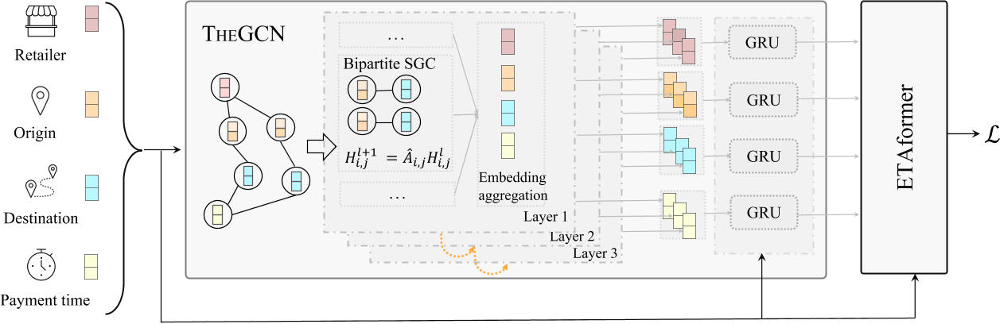

发表于WSDM '23

[论文地址：https://dl.acm.org/doi/abs/10.1145/3539597.3570409](https://dl.acm.org/doi/abs/10.1145/3539597.3570409)

论文代码：https://github.com/enoche/IGT-WSDM23.

# 摘要

为电子商务平台为用户提供购买页面上包交付的准确估计时间对其购买决策和购买后体验非常重要。尽管这个问题与传统的估计到达时间 (ETA) 有一些共同的问题，但以下几个方面更具挑战性：1）归纳推理。模型需要为看不见的零售商和地址订单预测ETA;2)订单语义信息的高阶交互。除了时空特征外，估计时间也与其他因素有很大差异，例如零售商的包装效率，以及这些因素的高阶相互作用。在本文中，我们提出了一种归纳图转换器(IGT)，它利用原始特征信息和结构图数据来估计包交付时间。与之前的图转换器架构不同，IGT 采用解耦管道，训练转换器作为回归函数，可以从图神经网络 (GNN) 编码的原始特征和密集嵌入中捕获多路信息。此外，我们通过去除 GNN 的非线性激活和可学习的线性变换矩阵来进一步简化 GNN 结构。简化GNN中参数搜索空间的减少和线性信息传播使IGT应用于大规模工业场景。在真实物流数据集上的实验表明，我们提出的模型在配送时间估计方面明显优于最先进的方法。

<!--more-->

# Introduction

电子商务平台上的零售商向消费者展示有关其产品和服务的各种信息，如价格、描述和预计交付时间。当消费者有收到包裹的最后期限时，交货时间比价格更重要。它已被证明会影响87%的在线消费者的决策。因此，对包裹到达时间（ETA）的准确估计不仅会影响电子商务收入，还会影响消费者的预期。无论是承诺过高还是承诺不足，ETA都可能对在线零售商和消费者造成损害。

在实践中，由于零售商的包装效率、库存、调度或运输因素，实际交付时间总是存在不确定性。在我们的场景中，我们研究了出发地-目的地（OD）交付时间估计，该估计旨在预测给定零售商、OD地址和付款时间信息的包裹交付时间。尽管OD行程时间估计在运输领域得到了广泛研究，但其挑战通常与交付场景中的OD ETA不同。例如，这两个问题都面临着缺乏路线信息和有效利用时空特征的挑战。然而，交付场景中的OD ETA不可避免地涉及预测与看不见的零售商或地址等的订单。此外，其预测根据多路信号（例如，零售商、地址、支付时间）和这些信号的高阶相互作用而变化很大。

交通领域的现有工作要求在模型训练期间OD图中的所有地址都存在，使得它们很难被泛化到看不到的旅程；另一项工作利用深度神经网络根据原始特征预测ETA。然而，它们未能捕捉到包属性（例如零售商、地址和支付时间）之间相互作用的高阶语义信息，这也可能会影响 ETA 预测的准确性。最接近的研究是阿里巴巴集团在Ele.me[43]上进行的食品交付时间估计。然而，它侧重于城市层面的食品输送，并强调了它对现有模型特征工程的贡献。

在**本文**中，我们提出了一种归纳图转换器 (IGT) 来估计国家层面的包交付时间。与当前耦合图转换器 [10, 17] 利用转换器作为 GNN 中信息聚合器的替代相反，我们将 IGT 中的 GNN 和转换器管道解耦。具体来说，我们使用转换器作为回归函数，并将收集到的顺序框架构建到 NLP 的句子中。与语言处理句子中的词类似，我们将零售商、地址和支付时间表示为“元素”。通过这种方式，我们可以将顺序表示为具有不同类型节点（即元素）的异构图，并通过 GNN 的信息传播捕获高阶语义关系。此外，我们通过简化 GNN 并去除非线性激活和线性变换矩阵来使我们的模型适应大规模场景。在以下部分中，我们将根据讨论的上下文交替使用术语“元素”和“节点”。通过我们简化的 GNN，可以根据观察到的相邻元素来近似顺序中看不见元素的嵌入。在实践中，订单具有周期性和反复出现的性质。我们使用门控循环单元 (GRU) 捕获元素的时间演化。最后，我们将订单的节点嵌入和原始特征融合到类似transformer的ETA预测架构中。

总之，这项工作的贡献如下：

* 我们提出了一种归纳图转换器，用于包交付中的 ETA 预测。我们没有使用 Transformer 作为 GNN 中邻域信息聚合的替代注意力机制，而是使用解耦架构，该架构将提取的异构信息从 GNN 中提取，将订单的原始特征馈送到 Transformer 中进行 ETA 预测
* 我们设计了一个简化的异构图卷积网络，可以将高阶语义信息编码为潜在元素嵌入，并使用 GRU 动态更新元素嵌入。具体来说，我们去掉了当前图卷积网络的非线性激活和线性变换矩阵，以适应大规模的工业场景。因此，在IGT中只保留用于信息聚合和传播的线性算子
* 我们在两个大规模物流数据集上进行了综合实验，结果表明所提出的模型明显优于现有方法

# RELATED WORK

## Estimated Time of Arrival（ETA）

以前的ETA预测方法可以分为两大类:

1)基于路径的方法。Route-based Methods

2)基于OD的模型。OD-based Methods.

### Route-based Methods

显然，基于路线的模型考虑了路线信息。在路线信息可用的情况下，一系列工作使用（图）神经网络对空间和时间依赖性进行编码。上述网络假设节点存在于嵌入的训练中，并且不适用于归纳设置

### OD-based Methods.

由于隐私考虑，在许多应用场景中通常很难获得路径信息。在这种情况下，提出了利用出发地和目的地特征进行ETA预测的基于OD的方法。最相关的现有工作是食品递送的ETA预测[43]，它和我们的问题一样复杂，因为它依赖于来自快递员、餐馆和交通的许多特征。然而，这项工作主要集中在开发特征工程来补充现有的模型

## Graph Transformers

Transformer[28]、GNN及其变体在许多领域取得了巨大的成功。最近已经提出了一系列工作来将两者融合为graph transformer。例如，Yun等人在异构图上开发了graph transformer networks，旨在将给定的异构图转换为基于元路径的图，然后进行卷积[37]。值得注意的是，他们关注框架的使用背后的重点是解释生成的元路径。[17] 中开发了关于异构信息网络的另一种transformer。所提出的 graph transformer使用transformer代替 GAT 中的注意力机制。

此外，周等人。提出了一种基于transformer的生成模型，该模型通过直接从网络中的动态信息中学习来生成时间图 [ 38]。在 [ 10 ] 中，作者提出了一种对任意结构的同质图的 Transformer 神经网络架构的泛化。

这些现有的方法通常采用transformer的注意机制进行信息聚合，很难将它们应用于归纳图

# PROBLEM STATEMENT

本文旨在解决基于历史订单交付信息的ETA预测问题。在我们的场景中，平台会在消费者支付他们的产品或消费者观看产品页面时生成订单。我们正式定义了交付时间估计的顺序和问题，如下所示。

*定义 3.1：订单。顺序表示为元组：$x_𝑖$ =($𝑟_𝑖$ , $𝑜_𝑖 $, $𝑑_𝑖 $, $𝑡_𝑖 $),其中𝑟𝑖 表示零售商，𝑜𝑖 , 𝑑𝑖 分别是订单的起始位置和目的地。𝑡𝑖 是此订单的付款时间。顺序元组中的每个元素都与一个手工制作的动态特征向量相耦合，该向量描述其统计信息。因此，我们可以用 X = {x𝑖 |𝑖 = 1, 2, · · · , 𝑁 } 表示具有 𝑁 个历史订单的数据集和相关的交付时间 y = {$𝑦_𝑖$ |𝑖 = 1, 2, · · · , 𝑁 }。交付时间 𝑦𝑖 通常从支付到签收订单的时间计算。*

*定义3.2：交付时间估计问题。给定一组历史订单X、交货时间y和输入特征Z，我们的目标是估计查询订单$x_q$的交货时间𝑦$_𝑞$*

# INDUCTIVE GRAPH TRANSFORMER

自从图卷积网络(GCN)[20]首次被用来推广图结构数据上的卷积神经网络(CNN)以来，GCN及其变体已经成功地应用于各个领域。

因为根据历史订单可以很容易地构建订单图。订单元组中的每个元素在订单图中表示为节点，如果两个节点在同一个订单中出现，则它们被链接。考虑到处理大规模订单图的计算复杂性，我们进一步将链接限制到了一个订单中的相邻元素。

*定义 4.1：异构图的构造。具体来说，给定订单 (𝑟𝑖 , 𝑜𝑖 , 𝑑𝑖 , 𝑡𝑖 )，零售商节点 𝑟𝑖 只能连接到发件人地址节点 𝑜𝑖。发件人地址节点 𝑜𝑖 可以链接到零售商节点 𝑟𝑖 和接收者地址 𝑑𝑖 等。也就是说，每个顺序只会生成 6 条边而不是 12 条边。这样，图的密度可以下降一半。同时，通过堆叠更多的 GCN 卷积层，来自一个节点的信息可以传播到任何其他节点。*

使用构建的异构图，我们可以将图解耦为一组二部图，并在二部图上执行图卷积。GCN 中的转换算子和激活层对大规模图构成了令人望而却步的成本。我们用线性计算简化了图卷积层。然而，除了结构信息外，图中的节点可能表现出不同的时间模式。我们采用 GRU 来分析节点级时间序列轴上的时间相关性。GRU 通过使用更新门和重置门来解决标准循环神经网络 (RNN) 的梯度消失问题。与长短期记忆 (LSTM) 网络相比，GRU 训练速度更快，因为在训练期间更新的权重和参数数量较少。GRU 的输出和原始输入特征被输入到 Transformer 变体中进行最终预测。

图 1 显示了所提出的 IGT 模型的总体框架

它由两个主要模块组成：1）$T_{HE}$GCN（即Temporal和异构GCN）和2）ETAformer（即带有Transformers的ETA预测）。接下来，我们介绍每个组件的细节。
