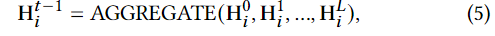

发表于WSDM '23

[论文地址：https://dl.acm.org/doi/abs/10.1145/3539597.3570409](https://dl.acm.org/doi/abs/10.1145/3539597.3570409)

论文代码：https://github.com/enoche/IGT-WSDM23.

# 摘要

为电子商务平台为用户提供购买页面上包交付的准确估计时间对其购买决策和购买后体验非常重要。尽管这个问题与传统的估计到达时间 (ETA) 有一些共同的问题，但以下几个方面更具挑战性：1）归纳推理。模型需要为看不见的零售商和地址订单预测ETA;2)订单语义信息的高阶交互。除了时空特征外，估计时间也与其他因素有很大差异，例如零售商的包装效率，以及这些因素的高阶相互作用。在本文中，我们提出了一种归纳图转换器(IGT)，它利用原始特征信息和结构图数据来估计包交付时间。与之前的图转换器架构不同，IGT 采用解耦管道，训练转换器作为回归函数，可以从图神经网络 (GNN) 编码的原始特征和密集嵌入中捕获多路信息。此外，我们通过去除 GNN 的非线性激活和可学习的线性变换矩阵来进一步简化 GNN 结构。简化GNN中参数搜索空间的减少和线性信息传播使IGT应用于大规模工业场景。在真实物流数据集上的实验表明，我们提出的模型在配送时间估计方面明显优于最先进的方法。

<!--more-->

# Introduction

电子商务平台上的零售商向消费者展示有关其产品和服务的各种信息，如价格、描述和预计交付时间。当消费者有收到包裹的最后期限时，交货时间比价格更重要。它已被证明会影响87%的在线消费者的决策。因此，对包裹到达时间（ETA）的准确估计不仅会影响电子商务收入，还会影响消费者的预期。无论是承诺过高还是承诺不足，ETA都可能对在线零售商和消费者造成损害。

在实践中，由于零售商的包装效率、库存、调度或运输因素，实际交付时间总是存在不确定性。在我们的场景中，我们研究了出发地-目的地（OD）交付时间估计，该估计旨在预测给定零售商、OD地址和付款时间信息的包裹交付时间。尽管OD行程时间估计在运输领域得到了广泛研究，但其挑战通常与交付场景中的OD ETA不同。例如，这两个问题都面临着缺乏路线信息和有效利用时空特征的挑战。然而，交付场景中的OD ETA不可避免地涉及预测与看不见的零售商或地址等的订单。此外，其预测根据多路信号（例如，零售商、地址、支付时间）和这些信号的高阶相互作用而变化很大。

交通领域的现有工作要求在模型训练期间OD图中的所有地址都存在，使得它们很难被泛化到看不到的旅程；另一项工作利用深度神经网络根据原始特征预测ETA。然而，它们未能捕捉到包属性（例如零售商、地址和支付时间）之间相互作用的高阶语义信息，这也可能会影响 ETA 预测的准确性。最接近的研究是阿里巴巴集团在Ele.me[43]上进行的食品交付时间估计。然而，它侧重于城市层面的食品输送，并强调了它对现有模型特征工程的贡献。

在**本文**中，我们提出了一种**归纳图转换器** (IGT) 来估计国家层面的包交付时间。与当前耦合图transformer [10, 17] 利用Transformer作为 GNN 中信息聚合器的替代相反，我们将 IGT 中的 GNN 和Transformer管道解耦。具体来说，我们使用转换器作为回归函数，并将收集到的顺序框架构建到 NLP 的句子中。与语言处理句子中的词类似，我们将零售商、地址和支付时间表示为“元素”。通过这种方式，我们可以将顺序表示为具有不同类型节点（即元素）的异构图，并通过 GNN 的信息传播捕获高阶语义关系。此外，我们通过简化 GNN 并去除非线性激活和线性变换矩阵来使我们的模型适应大规模场景。在以下部分中，我们将根据讨论的上下文交替使用术语“元素”和“节点”。通过我们简化的 GNN，可以根据观察到的相邻元素来近似顺序中看不见元素的嵌入。在实践中，订单具有周期性和反复出现的性质。我们使用门控循环单元 (GRU) 捕获元素的时间演化。最后，我们将订单的节点嵌入和原始特征融合到类似transformer的ETA预测架构中。

总之，这项工作的贡献如下：

* 我们提出了一种**归纳图转换器（Inductive Graph Transformer）**，用于包交付中的 ETA 预测。我们没有使用 Transformer 作为 GNN 中邻域信息聚合的替代注意力机制，而是使用解耦架构，该架构将提取的异构信息从 GNN 中提取，将订单的原始特征馈送到 Transformer 中进行 ETA 预测
* 我们设计了一个简化的**异构图卷积网络**，可以将高阶语义信息编码为潜在元素嵌入，并使用 GRU 动态更新元素嵌入。具体来说，我们去掉了当前图卷积网络的非线性激活和线性变换矩阵，以适应大规模的工业场景。因此，在IGT中只保留用于信息聚合和传播的线性算子
* 我们在两个大规模物流数据集上进行了综合实验，结果表明所提出的模型明显优于现有方法

# RELATED WORK

## Estimated Time of Arrival（ETA）

以前的ETA预测方法可以分为两大类:

1)基于路径的方法。Route-based Methods

2)基于OD的模型。OD-based Methods.

### Route-based Methods

显然，基于路线的模型考虑了路线信息。在路线信息可用的情况下，一系列工作使用（图）神经网络对空间和时间依赖性进行编码。上述网络假设节点存在于嵌入的训练中，并且不适用于归纳设置

### OD-based Methods.

由于隐私考虑，在许多应用场景中通常很难获得路径信息。在这种情况下，提出了利用出发地和目的地特征进行ETA预测的基于OD的方法。最相关的现有工作是食品递送的ETA预测[43]，它和我们的问题一样复杂，因为它依赖于来自快递员、餐馆和交通的许多特征。然而，这项工作主要集中在开发特征工程来补充现有的模型

## Graph Transformers

Transformer[28]、GNN及其变体在许多领域取得了巨大的成功。最近已经提出了一系列工作来将两者融合为graph transformer。例如，Yun等人在异构图上开发了graph transformer networks，旨在将给定的异构图转换为基于元路径的图，然后进行卷积[37]。值得注意的是，他们关注框架的使用背后的重点是解释生成的元路径。[17] 中开发了关于异构信息网络的另一种transformer。所提出的 graph transformer使用transformer代替 GAT 中的注意力机制。

此外，周等人。提出了一种基于transformer的生成模型，该模型通过直接从网络中的动态信息中学习来生成时间图 [ 38]。在 [ 10 ] 中，作者提出了一种对任意结构的同质图的 Transformer 神经网络架构的泛化。

这些现有的方法通常采用transformer的注意机制进行信息聚合，很难将它们应用于归纳图

# PROBLEM STATEMENT

本文旨在解决基于历史订单交付信息的ETA预测问题。在我们的场景中，平台会在消费者支付他们的产品或消费者观看产品页面时生成订单。我们正式定义了交付时间估计的顺序和问题，如下所示。

*定义 3.1：订单。顺序表示为元组：$x_𝑖$ =($𝑟_𝑖$ , $𝑜_𝑖 $, $𝑑_𝑖 $, $𝑡_𝑖 $),其中𝑟𝑖 表示零售商，𝑜𝑖 , 𝑑𝑖 分别是订单的起始位置和目的地。𝑡𝑖 是此订单的付款时间。顺序元组中的每个元素都与一个手工制作的动态特征向量相耦合，该向量描述其统计信息。因此，我们可以用 X = {x𝑖 |𝑖 = 1, 2, · · · , 𝑁 } 表示具有 𝑁 个历史订单的数据集和相关的交付时间 y = {$𝑦_𝑖$ |𝑖 = 1, 2, · · · , 𝑁 }。交付时间 𝑦𝑖 通常从支付到签收订单的时间计算。*

*定义3.2：交付时间估计问题。给定一组历史订单X、交货时间y和输入特征Z，我们的目标是估计查询订单$x_q$的交货时间𝑦$_𝑞$*

# INDUCTIVE GRAPH TRANSFORMER

自从图卷积网络(GCN)[20]首次被用来推广图结构数据上的卷积神经网络(CNN)以来，GCN及其变体已经成功地应用于各个领域。

因为根据历史订单可以很容易地构建订单图。订单元组中的每个元素在订单图中表示为节点，如果两个节点在同一个订单中出现，则它们被链接。考虑到处理大规模订单图的计算复杂性，我们进一步将链接限制到了一个订单中的相邻元素。

*定义 4.1：异构图的构造。具体来说，给定订单 (𝑟𝑖 , 𝑜𝑖 , 𝑑𝑖 , 𝑡𝑖 )，零售商节点 𝑟𝑖 只能连接到发件人地址节点 𝑜𝑖。发件人地址节点 𝑜𝑖 可以链接到零售商节点 𝑟𝑖 和接收者地址 𝑑𝑖 等。也就是说，每个顺序只会生成 6 条边而不是 12 条边。这样，图的密度可以下降一半。同时，通过堆叠更多的 GCN 卷积层，来自一个节点的信息可以传播到任何其他节点。*

使用构建的异构图，我们可以将图解耦为一组二部图，并在二部图上执行图卷积。GCN 中的转换算子和激活层对大规模图构成了令人望而却步的成本。我们用线性计算简化了图卷积层。然而，除了结构信息外，图中的节点可能表现出不同的时间模式。我们采用 GRU 来分析节点级时间序列轴上的时间相关性。GRU 通过使用更新门和重置门来解决标准循环神经网络 (RNN) 的梯度消失问题。与长短期记忆 (LSTM) 网络相比，GRU 训练速度更快，因为在训练期间更新的权重和参数数量较少。GRU 的输出和原始输入特征被输入到 Transformer 变体中进行最终预测。

图 1 显示了所提出的 IGT 模型的总体框架

它由两个主要模块组成：1）$T_{HE}$GCN（即 $\underline{\text{T}}$emporal和$ \underline{\text{HE}}$terogeneous GCN）和2）ETAformer（即带有Transformers的ETA预测）。接下来，我们介绍每个组件的细节。

## $T_{HE}$GCN

假设$G$=（V，E）是从历史订单导出的订单图，其中V和E分别表示节点集和边集。每个节点𝑣 ∈ V和每条边𝑒 ∈ E与类型映射函数相关联。我们的场景包括四种类型的节点和一种类型的边。因此，所构建的图将是一个异构图。我们首先介绍了GCN如何在同构图上工作，然后展示了如何将卷积算子应用于异构图。在第 𝑙 层递归更新隐藏嵌入 $H^𝑙$ 的同质图上的典型 GCN 定义为:

其中 W 是可学习的变换矩阵，𝜎 (·) 是非线性函数，例如 ReLu 函数。$\hat{A}$ = $\hat{D}^{−1/2}$ ($A$+$I$) $\hat{D}^{−1/2}$ 是邻接矩阵 A 的重新归一化。$\hat{D}$ = diag(𝑑1, · · · , $𝑑_{| V |}$ ) 是 $A+I$ 的对角度矩阵，其中对角线上的每个条目都等于邻接矩阵的行和 $𝑑_𝑖$ = 1 +$\sum_{j}$$a_{ij}$,在图中每个节点𝑣𝑖 有一个对应的𝐷-维度潜在特征向量h𝑖 ∈ R𝐷 . 初始特征矩阵$H^0$=$[$$h_0$，···，$h_{|V|}$$]^𝑇 $将|V|特征向量堆叠在另一个之上。

为了将图卷积算子应用于异构图，在其他领域提出了一些GCN变体[26，44]。然而，它们在计算上都很昂贵，并且容易过度拟合。受简化同构SGC[34]研究的启发，我们设计了一种异构GCN，它在不影响性能的情况下提高了计算效率。

与SGC[34]相比，我们进一步去除了其变换矩阵，以减少参数搜索空间。这使得我们的模型可以用大规模的数据集进行训练。给定异构图G，我们首先基于节点类型的组合构造一组二分子图。

假设节点类型的数量为𝑛, 二分子图的数量不会超过.

详细地说，我们构造了一个子图$G_{𝑖,𝑗}$ 基于两种节点类型从原始图G𝑖 和𝑗. 在G中𝑖,𝑗 , 节点的类型属于𝑖 或𝑗, 以及子图G中的任意两个节点𝑖,𝑗 如果它们在原始图G中连接，则将被链接。

作为G𝑖,𝑗 是无向的，我们有G𝑖,𝑗 = G𝑗,𝑖 . 我们将表示G𝑖,𝑗 的邻接矩阵为A𝑖,𝑗

如果节点𝑢 ∈ G𝑖,𝑗 与 G𝑖 ∈ G𝑖,𝑗 中的节点𝑣 ∈ G𝑖,𝑗 连接，则每个条目𝑅𝑢𝑣 ∈ R 为 1；否则，𝑅𝑢𝑣 设置为 0。按照 [ 20 ] ，我们还对 A𝑖,𝑗 执行重新归一化技巧，得到 $\hat{A_{ij}}$。为了对二分图(二部图)执行卷积运算，我们更新方程式（1）中的 vanilla（原始的） GCN为：

其中$H^l_{ij}$表示图$G_{i,j}$中的节点在GCN的第$l$层上的嵌入，假设类型为𝑖的节点数为𝑁𝑖，则H𝑖 ∈$R^{𝑁_𝑖 ×𝐷}$ 是节点类型𝑖的特征矩阵，通过在彼此之上堆叠这种类型的节点。

类似地，$H^l_{i,j}$ ∈ $R^{(𝑁𝑖 +𝑁𝑗 ) ×𝐷}$。请注意，公式3 通过移除折叠权重矩阵和非线性层来简化 vanilla GCN，这通过移除非线性激活进一步简化了 SGC [ 34]。同时，可训练参数的减少可以防止模型过度拟合。线性信息传播使模型能够在计算上是有效的。我们在图 1 中将二分图的这种简化的图卷积命名为二分图中的二分 SGC。

由于一种类型的节点可能涉及多个二部图，同时参与信息传播，我们将每层中每种类型的节点的传播信息聚合如下，

其中AGGREGATE 是一个聚合函数，𝑛 是节点类型的数量。在这里，我们使用总和聚合。其他聚合算子 [ 4 ] 也可用于聚合属于同一类型的节点的嵌入。在等式(4)，我们使用切片操作来提取𝑖型节点的嵌入。

每一层中此类信息聚合的一个好处是来自不同类型节点的信息可以完全相互集成。然后将集成的信息馈送到下一层以进行传播。另一个好处是，THEGCN在每次迭代中更新所有节点的嵌入，而不是一批节点，以避免内存陈旧问题（memory staleness problem）

通过在每一层获得的信息，我们通过聚合所有中间嵌入来更新节点在时间 t-1 的最终嵌入。即：

其中 L 是传播层数。聚合函数 AggREGATE 可以是 [ 4 ] 中讨论的任何函数。在这里，我们使用平均聚合进行最终节点更新。

为了进一步在时间 t-1 将时间信息融合到已学习的嵌入 $H^{t-1}_i$ 中，我们使用门控机制来控制和管理信息流

其中$Z^t_i$是订单中的𝑖型元素在时间 𝑡 时的原始输入特征向量。在这里，UPDATE 是一个可学习的更新函数，例如循环神经网络，就像 LSTM 或 GRU。在这项工作中，我们采用 GRU 网络，因为它拥有更少的门数，并且与 LSTM 一样有效

请注意，我们使用从历史订单构建的归一化邻接矩阵来避免模型训练阶段的数据泄漏。然而，在推理阶段，我们使用建立在训练和测试数据[14]上的归一化邻接矩阵。在归纳设置下，我们提出的 THEGCN 可以融合同一个订单xi 内来自其邻居的信息以学习未见节点的嵌入。在极端情况下，xi 中的所有节点在训练中都从未观察到 ，这意味着无法使用邻居信息。GCN 采用 GRU 从原始输入特征中更新节点的嵌入。因此，原始特征将用于估计该订单的交付时间。

## ETAformer

标准的Transformer被设计用来做单词预测，一个句子被视为一个完全连接的图。在本文的场景中，一个订单类似于一个NLP中的句子，其元素少于数十或者数百。因此，ETA 预测非常适合 Transformer

可以在这种完全连接的图上训练大型 Transformer 模型。此外，每个单词都关注 Transformer 架构中句子中的所有其他单词，这使得单词之间的高阶交互成为可能。

在 NLP 中，句子中单词的预测可能因上下文、其他单词等而异。等效地，在我们的场景中，ETA 预测不仅依赖于零售商、地址、支付时间，还有这些特征的高阶交互。

然而，标准Transformer假设单词被编码在相同的嵌入空间内。

在实践中，异构图中的节点可能因属于不同类型而在特征大小上有所不同。因此，要将输入特征向量封装到transformer中，我们首先需要**重塑特征空间：**

其中$Z_i$是节点i的原始特征，$h^t_i$是结点i经过THEGCN的输出嵌入，𝑓 是一个映射函数，用于对齐具有相同维度的节点。

一个直观的函数是使用多层感知器 (MLP) 将不同维空间的特征映射到同一个空间。但是，它为模型引入了额外的参数，因此我们对订单的每个节点采用零填充。

最后，我们将**订单重塑为**$x^i∈R^{n×W}$,其中n是一个订单中的元素数量，W是每个元素的填充嵌入大小。

为了捕获订单级别的信息，我们添加了一个类似于 BERT  和 ViT  的可学习**header token**。在实现中，我们使用带有一个隐藏层的 MLP 进行token学习。在位置编码上，现有的graph transformers设计了各种方法来保留节点之间的距离信息。我们的解耦架构利用了transformer的标准位置编码。因为在我们的场景中，一个订单$x_q$可以自然地构建为一个元素序列。将header token $e^{header}_q$和位置编码 $e^{pos}_q$以及x𝑞 的映射节点嵌入e𝑞 输入Transformer变体，在输出后，我们最终使用层归一化 (LN) 和单层 MLP 来预测 ETA，如图 2 所示。

形式上，我们将查询订单 x𝑞 的原始特征表示为 z𝑞 = ($z^1_q$, $z^2_q$`,..., `$z^n_q$ ),其中$Z^i_q$是订单中第i个元素的原始特征。基于类似Transformer的模型对订单xq的ETA预测可以表示如下：

## Model Training

为了训练所提出的 IGT 模型，我们使用 Adam [19] 作为优化器，并使用**平均绝对误差 (MAE)** 作为我们的损失函数。

# EXPERIMENTS

## Experimental Datasets

我们利用从世界最大的电子商务平台之一收集的两个大型物流数据集来评估 IGT 的性能以及基线。

*数据描述和统计*

第一个数据集包含来自 4,729 个零售商（用 D1 表示）的 8800 万个样本，范围从 2021 年 1 月 3 日到 4 月 22 日。第二个数据集包括从8,741零售商(用D2表示)收集的180万个样本，从2021年6月3日至7月22日不等。

这两个数据集不仅在图形大小、采集时间上有差异，而且在采集区域上也有差异。这两个数据集都是针对固定接收城市的订单。具体而言，D1是与发送到中国威海的所有订单一起收集的。D2适用于面向中国杭州的包裹。接收城市杭州的人口是威海的3倍。

对于 ETA 预测，我们遵循时间数据拆分进行**训练、验证和测试**。具体来说，我们将 D1 的最后 25 天的顺序拆分 10:15 作为验证和测试，D2 的最后 15 天 5:10，其他天的顺序用于训练。

在表1中，我们将看不见的节点（例如，零售商、地址）表示为测试中从未在训练中出现过的节点。请注意，数据集还收集了零售商、付款时间、发件人地址和收件人地址的演变特征。

## Comparison Methods and Metrics

我们将所提出的IGT模型与以下基线进行了比较。

* Linear Regression 通过基于订单的原始特征训练线性回归模型来对订单的交付时间进行建模。
* XGBoost 是一个基于梯度提升决策树的回归模型。输入与LR模型相同。
* MURAT 捕获基础道路网络结构以及用于OD行驶时间估计的时空先验知识。道路信息在我们的数据集中不可用，OD图是基于发送者和接收者地址构建的。
* xDeepFM 在极端深度分解机器框架中以显式和隐式方式学习低级和高阶特征交互。我们将推荐任务转换为 ETA 预测的回归任务
* TEMPrel 是一种基于OD的旅行时间估计方法。它平均所有具有相似起点和目的地的相邻路径的比例行驶时间，以进行ETA预测
* DeepETA 一个端到端的网络，用于估计最后一英里的包裹递送。该算法不仅考虑了路径特征，而且将时间和空间信息编码到深层神经网络中进行ETA预测。由于我们的数据中没有可用的路径信息，因此我们使用发送方和接收方地址作为路径历史
* HetETA 目标是估计出租车在城市内的到达时间。它使用门控卷积神经网络和ChebNet[6]来通过空间和时间视角捕捉两者之间的关系。该方法依赖于轨迹信息。同样，由于我们的数据缺乏这类信息，我们只在公路网上执行Het-ChebNet

## Performance Comparison

我们在MAE、平均绝对百分比误差(MAPE)和平均绝对相对误差(MARE)的度量下对我们的模型和所有基线进行了评估。

表 2 显示了所提出的 IGT 模型在两个数据集上的基线的性能比较。三个指标的结果表明，我们提出的模型能够将最佳基线提高 6% 以上。尤其是在数据集 D1 上，IGT 比最佳基线显着提高了 11%。与表 1 中的 D2 相比，D1 更稀疏。D1 和 D2 中每个零售商的平均订单数分别为 0.7 和 4.4。D1 和 D2 之间的结果表明 IGT 在稀疏图上表现更好。然而，稀疏性可能部分有助于提高性能。我们从信息论的角度分析了两个数据集的性能差异很大的原因

我们利用熵来量化支付时间下交付时间分布的熵。

$S^t$是在地点t下的订单的交货时间集合，发货时间差异较大的订单，在相同的时间t下单的信息熵更大。

实验显示数据集D1具有比数据集D2更大的平均熵值。因此，对于所有模型，D1的MAE值都远大于D2。

对于基线，LR的性能较差，主要是因为它只能使用原始特征进行回归任务。其他回归模型(如XGBoost和xDeepFM)可以捕获特征之间的交互，从而获得更好的性能。TEMPrel在两个数据集上都超过了LR，这意味着空间(即经度、纬度)和时间信息在ETA预测中的重要性。由于MURAT、DeepETA和HetETA的设计目的是利用路线信息进行ETA预测，因此它们的性能有所下降。然而，MURAT和HetETA利用图表示学习来学习OD链接的有意义嵌入，并获得比DeepETA更好的性能。类似地，我们的模型也使用图学习(即GCN)来捕获顺序之间的结构信息。不过，我们专注于节点表示学习和连接零售商、地址和支付时间的链接，链接通过连接这些节点的嵌入来表示。

## Ablation Study

IGT的解耦架构使我们可以在不需要另一个组件的前提下对每个组件进行ETA预测。

首先，为了评估THEGCN，我们将从THEGCN中获得的潜在嵌入拼接到一个单层MLP中，用于ETA预测。ETAformer可以直接处理原始特征。

结果表明，ETAform在ETA预测方面比THEGCN具有更好的性能。因为ETAform作用于订单间，所以它进一步探索订单元素之间的高阶交互。在表2中比较THEGCN和xDeepFM的性能，我们可以观察到，仅在IGT中使用THEGCN就可以获得与xDeepFM相当的性能。因为THEGCN还能够通过线性信息传播来提取订单间的高阶信息。表2中的训练时间表明THEGCN比ETAformer快得多。THEGCN和ETAformer的组合表现相比于基线有了显著提升。

## Hyper-parameter Study

我们检查了 THEGCN 中节点层数 𝐿 和嵌入大小如何影响 IGT 的性能。我们收集了 IGT 在超参数 𝐿 和 𝐷 在两个数据集上的网格搜索（D1 和 D2）下的 MAE 性能，并在图 5 中绘制热图。我们观察到 THEGCN 中隐藏嵌入的维数𝐷 对 ETA 预测具有更决定性的影响。在 THEGCN 中堆叠太多层可能会导致过度平滑 [21 ] 并退化预测性能。隐藏嵌入维数的一个很好的选择可能取决于数据集中的订单数量。

## Inductive and Transductive Learning of IGT

我们进一步分析了关于节点类型和每种节点类型中的阶数的预测结果。特别是，我们考察了在节点没有历史订单的归纳环境下IGT的预测性能。在我们的分析中，我们将IGT与xDeepFM进行比较，以阐明IGT可能提供显著优势的用例

付款时间。我们在图6中绘制了IGT和xDeepFM关于一天中支付时间的ETA预测性能图，从中我们可以观察到，我们提出的模型在每个支付时间都比最佳基线方法xDeepFM表现出更好的性能。显然，这两种模型的性能在支付时间上都表现出一定的波动。将图6与图3和图4进行比较时，我们发现订单的交付时间的熵与预测结果高度相关。更多的训练订单可能不会改善模型的ETA预测性能。这是合理的，因为较大的熵使模型无法准确估计交货时间。两个模型都在15：00左右对两个数据集显示出较大的预测误差。原因是，快递公司通常在15点左右将收集的包裹派送到下一站，此时之后订购的产品需要等待下一派送时段。在这两个数据集中，我们提出的IGT在峰值附近显示出比xDeepFM略有改善。

零售商和地址。由于这两个数据集都有来自看不见的零售商和地址的订单，我们可以评估IGT在归纳设置下的性能。我们采用数据装箱来减少订单数量相对于零售商和地址的基数。

具体来说，我们将一名零售商收到的订单数量分为几组：unseen (𝑁 = 0), small (0 < 𝑁 ≤ 100), medium (100 < 𝑁 ≤ 500) and large (500 < 𝑁 )

类似地，我们将与发送者地址关联的订单数量分成组：unseen (𝑁 = 0), small (0 < 𝑁 ≤ 500), medium (500 < 𝑁 ≤ 1000) and large (1000 < 𝑁 )

我们在图7中绘制了大小大于50的组的预测性能。在归纳学习环境中，IGT在零售商和地址下的两个数据集上都表现出比xDeepFM更好的预测性能。请注意，IGT将数据集D1的看不见的地址上的MAE值降低了xDeepFM的一半。

尽管未见地址上的订单数量相对较少，因为预测值显示出更高的方差，但我们可以看到 IGT 在图 7 左侧归纳学习中优于 xDeepFM

图7的右边部分显示，对于来自同一零售商或地址的历史订单的积累，这两个模型并不总是学习得很好,尤其是在数据集D1上，零售商的订单数量越多，这两个模型的性能都会降低。与零售商的角度相比，地址上的订单积累显示出在两个数据集上两个模型的持续改进。

# ONLINE EXPERIMENT

为了进一步评估IGT的有效性，我们在线评估其性能。我们对IGT在电子商务平台上的表现进行了为期一周的评估。我们将整个用户请求分成1/10来测试我们的模型。MAE、MAPE和MARE分别为9.86小时、14.36%和15.83%。与表2相比，国家级评估绩效介于D1和D2之间。结果表明，人口较多的城市在预计到达时间上的MAE通常较低。与原始服务模型相比，我们的模型可以将平均预测误差（即MAE）降低15%。

# CONCLUSION AND FUTURE WORK

在本文中，我们提出了一种归纳图转换器 (IGT) 来估计包交付时间。我们使用解耦架构通过时间和异构 GCN 和元素的交互来捕获订单的高阶交互，以便通过基于转换器的模型。看不见的节点的信息可以通过从模型中的相邻节点传播消息来学习。因此，结构信息和原始特征都可以在基于转换器的模型中用于准确的 ETA 预测。在我们的模型中，IGT，我们通过移除其非线性层和变换矩阵来简化 GCN。这允许工业场景将 IGT 应用于大规模数据集。两个大规模离线后勤数据集的实验结果证明了 IGT 在归纳和转导学习中的有效性。我们进一步评估了该模型在国家层面在线测试的表现。IGT 在电子商务平台上部署时能够增强数十亿客户的用户体验。对于未来的工作，我们将专注于为 ETA 预测而不是点估计提供置信区间。
