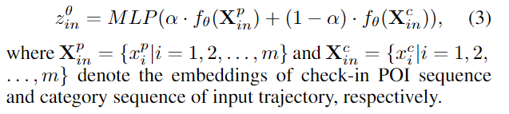
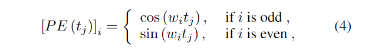
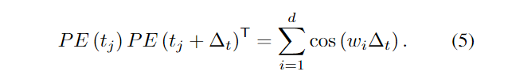

发表于( **IJCAI 2022** )

https://arxiv.org/abs/2205.03773

# 摘要

由于签到移动数据的稀疏性，将轨迹链接到生成它们的用户的轨迹-用户链接 (TUL) 是一个具有挑战性的问题。现有方法忽略了在签到数据中利用历史数据或丰富的上下文特征，导致 TUL 任务性能不佳。在本文中，我们提出了一种新的**相互蒸馏学习网络**来解决稀疏签到移动数据的 TUL 问题，称为 MainTUL。具体来说，MainTUL 由循环神经网络 (RNN) 轨迹编码器组成，该编码器对输入轨迹的顺序模式和捕获相应增强历史轨迹的长期时间依赖性的时间感知 Transformer 轨迹编码器。然后，在两个轨迹编码器之间传递在历史轨迹上学到的知识来指导两个编码器的学习，以实现信息的相互蒸馏。

# Introduction

在这项工作中，我们有兴趣将轨迹与其潜在用户联系起来以检查流动性数据。TUL 本质上可以看作是传统轨迹分类任务的扩展。传统的轨迹测量方法，例如最长公共子序列 (LCSS) 和动态时间规整 (DTW)，可以通过测量未知轨迹和已知轨迹之间的相似性来识别最可能的用户。

然而，现有的方法仍然有**三个关键的局限性**。首先，所有现有的方法仍然存在数据稀疏的问题，并且在稀疏的签入移动数据集上表现不佳。

第二，现有方法只关注空间和/或时间特征，而忽略了POI类别等签到数据中丰富的上下文特征。

第三，现有的方法大多忽视了对历史数据的利用。由于签到数据固有的稀疏性，同一用户的历史数据隐含了用户更复杂的运动模式，这可能有助于提高模型的性能。然而，如何有效地利用历史数据中的知识仍然是一个重大的挑战。

为了解决上述挑战，我们提出了 **MainTUL**，一个相互蒸馏学习网络模型，以解决稀疏签到轨迹数据的 TUL 问题。在 MainTUL 中，我们设计了两个不同的轨迹编码器——一个基于 *RNN* 的编码器来学习**输入轨迹的时空运动模式**，以及一个*时间感知转换器编码器*来捕获**相应增强轨迹的长期时间依赖性**。然后，将增强轨迹数据学到的知识转移到指导基于 RNN 的轨迹编码器的学习。同时，交换输入轨迹和增强轨迹，实现相互蒸馏学习网络。此外，我们还设计了一个签到嵌入层来生成与POI类别和时间信息集成的多语义签到表示，然后将其馈送到相互蒸馏学习网络中。

**主要贡献**：

* 我们提出了一个相互蒸馏学习网络模型 MainTUL，以解决稀疏签到轨迹数据的 TUL 问题。我们的 MainTUL 通过轨迹增强和知识蒸馏有效地利用历史数据来提高模型的性能。
* 我们在 MainTUL 中设计了一个时间感知变换器轨迹编码器来捕获增强轨迹中的长期时间依赖性。使用设计的轨迹编码器，我们的模型实现了信息的相互蒸馏。
* 我们在两个真实的签到移动性数据集上进行了广泛的实验。结果表明，在ACC@1和Macro-F1方面，我们的模型显著地比最先进的基线分别提高了14.95%和14.11%。

# Related Work

相关工作的缺陷：只考虑了空间或时空的邻近性，不能捕捉轨迹数据中的时间依赖关系；使用RNN进行建模或预测，不能有效地捕捉长期的时间依赖关系，并且所有方法都忽略了对历史数据的有效利用。

在这项工作中，我们首次尝试使用相互蒸馏策略来有效地利用从历史数据中提取的知识来提高 TUL 性能。

# Preliminaries

**Definition 1** (Check-in Record) 签到记录是一个三元组$< u, t, p >$，表示用户u在时间t访问$POI$ $p$，其中p表示(id, category, $l$)形式的唯一标识的地点，$l$表示POI的位置。

**Definition 2** (Trajectory) 轨迹是签到记录序列(<u, $t_1$, $p_1$ >， < u, $t_2$, $p_2$ >。, <u, t$_m$, $p_m$>) 由用户 u 在特定时间间隔 $τ $期间按时间顺序生成，用 $Tr^u_τ$ 表示。

时间间隔 τ 设置为 24 小时

**Problem** (Trajectory-User Linking)TUL 的任务是使用生成它们的用户识别匿名轨迹。令 T = {$Tr_1$, $Tr_2$,., $Tr_n$} 表示未链接轨迹的集合，U = {u1, u2,., $u_m$} 表示一组用户。我们的目标是找到满足以下条件的映射函数 f (·)

其中$ y_i$ 是轨迹 $Tr_i$ 的真实标签，‖·‖ 表示差异评估算子（例如，如果 i = j，‖$u_i$ - $u_j$ ‖ = 0，否则为 1），$F$ 是 TUL 任务的假设空间.

# Methodology

MainTUL 的架构如图 1 所示。 MainTUL 包含三个主要组件：签到嵌入、轨迹编码器和相互蒸馏网络。

## Multi-Semantic Check-in Embedding

该模块包含两个子模块：轨迹增强和签到嵌入层。

### **Trajectory Augmentation**

对于签到数据来说，由于其固有的稀疏性，一个时间窗口内子轨迹中的用户签到次数非常有限，而其长期的历史轨迹往往意味着更多的用户运动模式。因此，我们探索了两种不同的轨迹增强策略来生成相互蒸馏学习的长期轨迹：

* *Neighbor Augmentatio*n 给定时间间隔$ τ_i$ 中的输入轨迹 $T_r$，我们在时间间隔 [$τ_{i−k/2}$ : $τ_{i+k/2}$] 中使用 k + 1 个子轨迹按时间顺序形成长期增强轨迹。
* *Random Augmentation* 对于输入轨迹，我们从相应用户的所有轨迹中随机抽取 k 个子轨迹，然后根据时间信息形成长期轨迹与输入轨迹。

### **Check-in Embedding Layer	**

多语义签到嵌入的目标是从稀疏的 one-hot 表示中生成签到（例如位置、类别和时间切片）中每个部分的密集表示。通过这种方式，我们不仅避免了维度的诅咒，还捕获了上下文语义信息。对于每个轨迹，我们实际上有两种序列形式，一种是POI序列，另一种是POI类别序列。我们将周期时间间隔(例如，一天)划分为多个时间片(例如，一个时间片一个小时)，并将签到时间戳映射到相应的时间片。最后，我们分别学习与时间片集成的两个序列的嵌入，如下所示**：**

其中 pi、ci 和 ti 是序列中第 i 个 POI、它的类别和时间片的 one-hot 编码，$W_p$、$W_c$、$W_t$、$b_p$、$b_c$ 和 $b_t$ 是可学习的参数。

## Trajectory Encoder

为了学习轨迹序列中的高阶转换模式，需要设计轨迹编码器。我们注意到输入轨迹和增强的长期轨迹的序列长度差异很大。过于复杂的轨迹编码器不适合处理较短的轨迹，过于简单的轨迹编码器无法捕获长轨迹序列的长期依赖关系。因此，我们分别基于RNN模型和时间感知自注意力网络设计了两种不同的轨迹编码器。

### **RNN-based Encoder**

由于签到轨迹的稀疏性，我们使用了流行的 RNN 变体，长短期记忆网络 (LSTM)作为用于处理输入轨迹的编码器 fθ (·)。对于签到 POI 和类别序列，我们使用共享编码器 fθ (·) 并选择最后一个时间步的隐藏层嵌入作为两个序列的表示。然后我们使用可学习的参数 α 来平衡两个表示的权重，并通过多层感知器 (MLP) 将它们映射到用户维度，以获得输入轨迹的最终表示:

分别表示签到 POI 序列的嵌入和输入轨迹的类别序列。

### **Temporal-aware Transformer Encoder**

Transformer 架构对于长期和短期依赖关系都非常富有表现力和灵活性，这已被证明在处理长序列方面优于传统序列模型。然而，对于长轨迹序列，需要注意的是，仍然存在一个问题，即时间切片信息不能完全反映轨迹在时间维度上的信息变化(例如，相对访问时间差)。因此，受Zuo et al.的启发，我们设计了一个时间感知位置编码器来替换原始转换器中的位置编码器：

其中 $w_i $是一个可学习的参数，$i $是嵌入维度 ($i$ ≤ 2d) 的顺序,$t_j$是第 j 个检查记录的访问时间戳。

因此，对于序列中的任意两个 POI 或类别，相对访问时间信息可以通过以下方式捕获：

