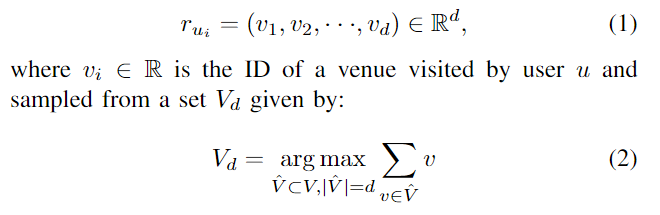
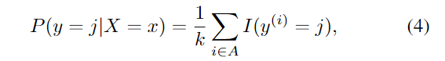

2022 IEEE International Conference on Big Data (Big Data) 

[[2212.07081] Trajectory-User Linking Is Easier Than You Think (arxiv.org)](https://arxiv.org/abs/2212.07081 "论文地址")

# 摘要

证明了访问模式在用户中是高度独特的，因此直接应用于原始数据的简单启发式足以解决TUL。更具体地说，我们证明了每个轨迹的一次签到足以在85%的时间内正确预测用户的身份。此外，通过使用非参数分类器，我们将TUL扩展到超过10万用户，这比最先进的水平增加了三个数量级。

<!--more-->

# Introduction

TUL是最近引入的一种移动分类任务，其中匿名轨迹链接到生成它们的用户。可扩展性是TUL现有工作的一个主要限制,以往的工作忽略了人类移动数据的两个特征:1)用户之间移动模式的唯一性，2)人类移动模式的高度可预测性.作者认为，由于移动模式在用户中是高度独特的，TUL可以通过直接应用于原始轨迹数据本身的简单启发式来解决。

所作的贡献总结如下:

•经验证明签入模式在用户中是高度独特的。更具体地说，每个轨迹的一次签到足以在85%的时间内正确预测用户的身份。

•经验证明，应用于原始轨迹数据的简单启发式方法不仅足以解决TUL问题，而且优于最先进的方法。

•将TUL扩展到超过10万用户，这比最先进的技术增加了三个数量级。

# Previous works

以前的工作仅限于对几百个用户的轨迹进行分类。原因在于使用了一个分类层，每个目标用户都有一个硬编码输出。训练一个具有大量输出的Softmax层是具有挑战性的，并且计算成本很高。更不用说每次添加新用户时，模型都需要从头开始重新训练。

# TRAJECTORY-USER LINKING

## Problem definition

三元组（u,t,v），用户u在地点v和时间t的签到记录，用户u在时间间隔τ上生成的n个按时间顺序签到记录的序列称为轨迹，$T_{uτ}$ ={(u, $t_1$ , $v_1$), (u,$t_2$ , $v_2$)}, · · ·, (u, $t_1n$ , $v_n$)}

求解TUL的三个连续步骤:1)轨迹分割，2)轨迹编码，最后3)轨迹分类。

## Trajectory segmentation

将每个轨迹分割为k个连续的子轨迹，跨越更短的时间间隔τ,分割间隔τ可以设置为任何时间段，例如一天或一个小时。

## Trajectory encoding

由于子轨迹的长度不同（签到次数），我们首先需要将输入子轨迹转换为统一维度 d 的向量 $r_{ui}$,通过将签到投影到维度为 d 的空间，可以以无监督的方式学习这样的向量

换句话说，用户 u 的子轨迹 $T_{ui}$ 由其 d 个最大场地 ID 的串联编码。该向量接下来用于分类。

## Trajectory classification

为了对轨迹进行分类，我们使用 k-最近邻分类器。k-NN 是一种非参数监督分类算法，其中根据 k 个最近邻的多数类成员资格，为未标记的对象分配一个类标签。邻居来自一组已知标签的对象。这可以被认为是算法的训练数据集，尽管不需要明确的训练步骤。对象之间的接近度是使用距离度量确定的，例如欧几里得距离.

其中 k 是从训练集 A 中提取的最近邻数，I(x) 是当参数 x 为真时评估为 1 的隶属函数，否则为 0。值得注意的是，k 是 k-NN 算法的唯一超参数，通常设置为奇数值以防止平局情况.

k-NN分类器将轨迹的d维编码作为输入，并生成指示用户身份的标签作为输出

# EXPERIMENTS

## 数据集

我们使用了四个广泛用于TUL的签入数据集：BrightKite[27]、Foursquare[28]、Gowalla[27]和WeePlaces[29]

在3个不同的时间尺度(日、周和月)处理每个数据集，总共生成12个数据集。每天、每周和每月分别至少3次、5次和10次签到。只保留至少有10个轨迹的用户。我们用从0开始的序列号替换了用户ID和会场ID。最后，我们按照用户ID和时间戳以升序对数据集进行了排序。

## Evaluation

Accuracy at k (ACC@k), Macro F1 score (Macro-F1), Macro precision (Macro-P) and Macro recall (Macro-R) 是TUL最常用的评估指标。

通过分层抽样实施的三次交叉验证[30]而获得的上述指标的平均值。

## Hyperparameter tuning

k-NN，将k设置为3

## Uniqueness of visit patterns

：不同用户之间的访问模式有多独特？

1. 对于每日、每周和每月的数据集，平均每个用户分别有47、60和124个独特的地点
2. 盒子图中可以清楚地看到，用户在X轴(场馆ID)上是分开的，即不同的用户访问不同的场馆。
3. 通过每个数据集中前25个用户的Jaccard距离矩阵。很明显，没有两个用户会访问同一套场馆。

即超过99%的用户访问的场馆是他们自己独有的。结果表明，用户之间的访问模式具有很高的唯一性，这促使我们研究启发式算法是否足以解决TUL问题。

## Are heuristics sufficient to solve TUL?

图4总结了所获得的结果，绘制成相对于d的递增值的分类性能。我们将d值限制为3，因为它是每个轨迹在不同时间间隔上保证的最小检入次数。在所有数据集上，较小的d会产生更好的分类结果。事实上，对于d=1，日轨迹、周轨迹和月轨迹的平均F1得分分别为74.4%、80.9%和85.7%。这很重要，因为它意味着每个轨迹的一次签到足以在高达85%的时间内正确预测用户的身份。请记住，对于d=1，欧几里德距离变为减法，因此k-NN分类类似于应用于场馆ID的简单阈值操作。

性能随d增加而降低的程度与时间间隔成反比关系，而且，时间间隔越短，分类性能就越差。

根据之前的启发式方法（启发式算法定义：一个基于直观或经验构造的算法，在可接受的花费（指计算时间和空间）下给出待解决[组合优化](https://baike.baidu.com/item/%E7%BB%84%E5%90%88%E4%BC%98%E5%8C%96/3314860?fromModule=lemma_inlink)问题每一个实例的一个[可行解](https://baike.baidu.com/item/%E5%8F%AF%E8%A1%8C%E8%A7%A3/962143?fromModule=lemma_inlink)，该可行解与最优解的偏离程度一般不能被预计。），由于我们已经演示了不同的用户访问不同的场馆，因此根据场馆之间的共同程度对场馆进行分类更加直接，即，在k-NN分类器中用贾卡德距离代替欧几里德距离，并且使用原始轨迹而不是样本。

获得的结果与图 4 中报告的结果非常相似，但以更高的计算成本为代价。这可以归因于在某些情况下，轨迹可以非常长地到达几百个场地的事实。此外，我们尝试了 max 以外的不同轨迹采样方法，例如 min 和中位数。然而， max的性能优于其他的，这是数据预处理方式所固有的，这自然会导致 maxvenue ID 很有可能是用户的唯一标识符

可以得到结论，场地在用户中是高度独特的，对原始数据应用简单的启发式方法足以解决高达85%的TUL问题。

## Performance vs. time interval

绘制了所有数据集上分类性能与时间间隔的关系。为了隔离时间间隔对性能的影响，我们将用户数量固定为每个数据集所有时间间隔中最小的用户数量。得到的结果大多支持先前的实验，因为性能与时间间隔长度直接相关。用户数量设置为top N，其中N是每个数据集的三个时间间隔中最小的用户数量。

## Scaling up TUL

绘制了分类性能与用户数量增加的关系。用户数量从10开始增加一个数量级。值得注意的是，增加用户数量意味着增加轨迹的数量，从而增加k- nn算法的搜索空间。因此，分类性能随着用户数量的增加而下降。

值得注意的是，据我们所知，我们是第一个将TUL用户扩大到10万以上。比目前最先进的提升了三个数量级

## Comparison with state-of-the-art

平均而言，我们的结果(Macro-F1)在Brightkite、Foursquare、Gowalla和Weeplaces上分别比最先进的技术高出2.6%、1.2%、4.7%和42%。

总之，得到的结果表明，简单的启发式方法不仅足以解决TUL问题，而且还优于利用复杂深度学习模型的最先进的工作。

## Discussion

虽然乍一看，简单的启发式优于深度模型似乎是违反直觉的，但我们已经清楚地证明了用户之间的访问模式是高度独特的，即不同的用户访问几乎完全不同的场所，这与[11]中的发现一致，并被广泛采用的TUL评估设置放大，该评估设置从随机选择的用户(通常是最活跃的用户)中绘制轨迹，使用从不同城市和/或国家活跃用户的社交媒体账户中收集的签到数据集。不同城市的用户访问完全不同的场所，因此使用简单的启发式很容易区分他们的轨迹，正如我们在实验部分演示的那样。

仍然没有完全回答的问题是:为什么每个子轨迹的最大场地ID是一个有效的特征?换句话说，为什么ID值最大的场地(同一用户在同一子轨迹上访问过的场地中)是用户身份的有效指标?**答案**就在于数据预处理的方式，其中所有用户的签入记录首先被匿名化(用户ID和场所ID被替换为顺序数字)。然后，按用户ID、场所ID和时间戳排序。这意味着，给定一个用户，对他们来说唯一的场所(例如，家庭)被分配的id(顺序数字)比其他用户访问的场所(例如，餐馆)的值更高。因此，通过对用户在给定子轨迹中访问的所有场馆id应用最大操作符，等于在所有用户中找到该用户唯一的一个场馆。这样的地点可以是家(对用户来说是唯一的，除非两个或多个用户共享同一个房子)，在足够长的时间间隔内，它极有可能包含在给定用户的大多数子轨迹中。事实上，这并不总是正确的，否则我们的分类结果将是完美的。

我们认为，考虑到当前的TUL评估设置，将匿名轨迹与其用户链接起来类似于对不同颜色的图像块进行分类。色度分类是一项简单的任务，可以通过像素阈值来完成，而**不需要具有数百万个学习参数的复杂视觉模型**。同样，由于不同的用户访问不同的场所，求解TUL不需要学习捕获单个用户特有的复杂时空移动模式的表示。而是**找到每个用户唯一的场所**(例如，家)

# SUMMARY

TUL是一种相对较新的移动分类任务[1]，其中匿名轨迹与生成它们的用户相关联。在过去的5年里，TUL在个性化推荐、流行病预防和犯罪行为检测等方面得到了越来越多的关注。

以前关于TUL的工作主要集中在学习深度表示，捕捉单个用户特有的复杂时空移动模式。可伸缩性是以前的作品的一个主要限制，目标用户最多不超过1000

在本文中，我们认为，由于用户[11]之间的访问模式是**高度独特**的，TUL可以通过直接应用于**原始数据的简单启发式**来求解。我们通过对四个真实世界的数据集(Brightkite、Foursquare、Gowalla和Weeplaces)进行广泛的分析，实证地验证了我们的论点，并证明启发式方法不仅足以解决TUL问题，而且优于利用复杂模型的最先进方法。此外，使用非参数分类器，我们将TUL扩展到超过10万用户，这比最先进的技术增加了三个数量级。

虽然需要将我们的结果与最先进的技术进行比较，但重要的是要提醒读者，我们在本文中并不是为了提出一种新的算法来解决TUL，而是**邀请研究界重新思考现有的解决方案**、数据集和评估设置，同时更好地关注一般人类流动性数据和具体社会签到数据的统计和性质。
